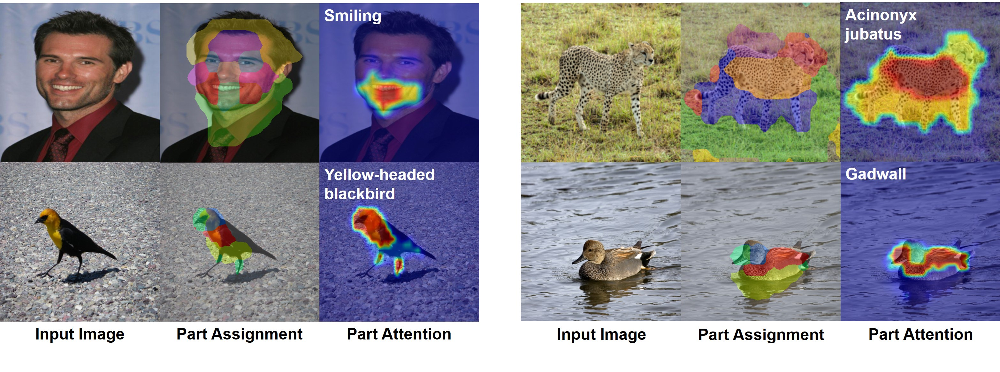

# Interp-Parts

Code repository for our paper "Interpretable and Accurate Fine-grained Recognition via Region Grouping" in CVPR 2020 (*Oral Presentation*).



[[Project Page]](https://www.biostat.wisc.edu/~yli/cvpr2020-interp/)  [[Paper]](https://arxiv.org/abs/2005.10411)

The repository is still under construction. The full training, inference and evaluation pipeline on CelebA dataset is currently included.


## Dependencies

* p7zip (used for uncompression)
* Python 3
* Pytorch 1.4.0+
* OpenCV-Python
* Numpy
* Scipy
* MatplotLib
* Scikit-learn

## Dataset

You will need to download both aligned and unaligned face images (JPEG format) in CelebA dataset at http://mmlab.ie.cuhk.edu.hk/projects/CelebA.html. Make sure your ```data/celeba``` folder is structured as follows:

```
├── img_align_celeba.zip
├── img_celeba.7z.001
├── ...
├── img_celeba.7z.014
└── annotation.zip
```

We provide a bash script to unpack all images. You can use
```sh
cd ./data/celeba
sh data_processing.sh
```
It might take more than 30 minutes to uncompress all the data.


## Example

Helper for training parameters:

```sh
cd src
python train.py --config-help
```
### Training (Unaligned CelebA from SCOPS)
Training (You can specify the desired settings in celeba_res101.json):

```sh
cd src
python train.py --config ../celeba_res101.json
```

The code will create three folders for model checkpoints (./checkpoint), log files (./log) and tensorboard logs (./tensorboard_log).

### Visualization and Evaluation (Unaligned CelebA from SCOPS)
Visualization of the results (assuming a ResNet 101 model trained with 9 parts):

```sh
cd src
python visualize.py --load celeba_res101_p9
```
The code will create a new folder (./visualization) for output images (25 by default).

Evaluating interpretability using part localization (assuming a ResNet101 model trained with 9 parts):

```sh
cd src
python eval_interp.py --load celeba_res101_p9
```
This should reproduce our results in Table 2.

Evaluating accuracy (assuming a ResNet101 model trained with 9 parts):

```sh
cd src
python eval_acc.py --load celeba_res101_p9
```
This will report the classification accuracy  (mean class accuracy) on the test set of SCOPS split.

### Reproduce Results in Table 1 (Aligned CelebA)
Training (You need to change the split to *accuracy* in celeba_res101.json):

```sh
cd src
python train.py --config ../celeba_res101.json
```

Evaluation:
```sh
cd src
python eval_acc.py --load celeba_res101_p9
```

## References
If you are using our code, please consider citing our paper.
```
@InProceedings{Huang_2020_CVPR,
author = {Huang, Zixuan and Li, Yin},
title = {Interpretable and Accurate Fine-grained Recognition via Region Grouping},
booktitle = {The IEEE/CVF Conference on Computer Vision and Pattern Recognition (CVPR)},
month = {June},
year = {2020}
}
```

If you are using CelebA dataset, please cite
```
@inproceedings{liu2015faceattributes,
 title = {Deep Learning Face Attributes in the Wild},
 author = {Liu, Ziwei and Luo, Ping and Wang, Xiaogang and Tang, Xiaoou},
 booktitle = {Proceedings of International Conference on Computer Vision (ICCV)},
 month = {December},
 year = {2015}
}
```
